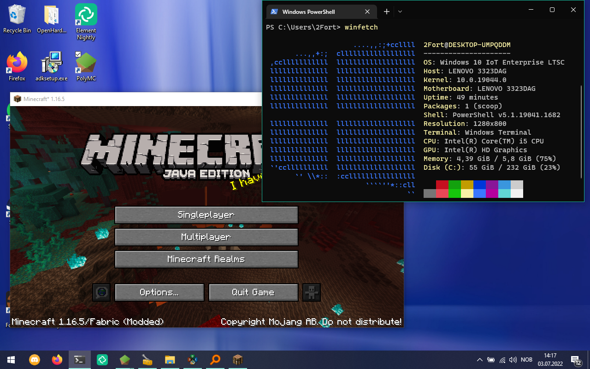

# OpenGL Support for Legacy Intel iGPUs on Adoptium
This is a repository containing a .sdb file that enables support for Legacy Intel integrated GPUs for Adoptium/Temurin JREs. 
Without this, applications like Minecraft will be unable to run. This will only work on Windows 10 and higher.
## How does it work?
Intel drivers are targetted towards NT kernel version 6, but Windows 10 and higher have changed the NT version to 10 or higher. This breaks compatibility with OpenGL.
What we are doing is making a fix by using an sdb file that patches javaw. It tricks java into thinking it's running on Windows 8.1 and loads the OpenGL driver needed.
## Screenshot proof

## FAQ
### What versions of Minecraft can you run?
You can run any version =< 1.16.5. Any higher doesn't seem to work, because it requires an OpenGL version the chip is incapable of running.
### What architecture is this targetted at?
The .sdb is intended for 64-bit Adoptium/Temurin installations at the moment, as I can't be bothered to make one for 32-bit machines.

